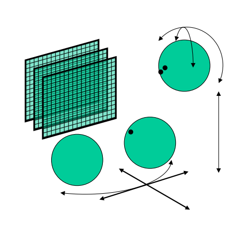
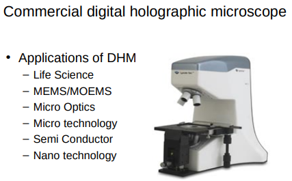

# Digital Holography

- Types of holograms:
    - 2D
    - stereo (3D cinema)
    - holographic images of real world scenes
    - and real world scenes themselves

- Applications of digital holograms:
    - Goodman "Fourier Optics"

Digital holography is used in microscopy for life science, microtechnology etc.

From a standard picture you can only get a focus on one plane. With a hologram you can focus on different planes.

### Holographic 3D displays are known for their advanced properties:

- **Multiple Viewers, Unique Perspectives**: They allow an arbitrary number of viewers, each experiencing a unique perspective from different locations.
- **Freedom of Movement**: Viewers can move around freely, maintaining the 3D effect.
- **Motion Parallax**: Offers a realistic experience with motion parallax in all directions, including vertical and horizontal.
- **Natural Focus**: Viewers can naturally focus at different depths in the scene, eliminating accommodation/vergence rivalry common in other 3D technologies.
- **High-Quality Display**: Equipped with state-of-the-art features like autostereoscopy and high video frame rates, comparable to the best in current display technologies.

We can determine depth of objects based on perspective.

We can also determine depth based on the difference between the left and right eye images. This is called **stereo vision**.

- Blebbing:
    - Phenomenon in which the cell membrane of a cell forms bulges (biology).
    - Only visible with holography. Better detail in holography which can give more information about an object.
    - Major application of holography is detecting cancerous cells because of the information that can be obtained from the hologram.

