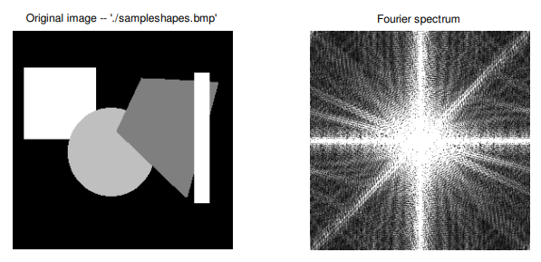

**Fourier Transform**

```input image -> fourier tranform -> output image```

- Image is represented as a matrix
- Each value in the matrix represents the intensity of the pixel at that position at a positive value
- For greyscale the values are 0 -> 255

```fourier transform == fourier domain == fourier specturm```

- Fourier transform is a lossless operation; like reversing a list, no information is changed
    - Sorting a list destroys information - lossy
    - Applying fourier twice - retrieves the original image

The _center_ of the Fourier transform is responsible for the **gross features** of the image. (e.g. the edges of shapes)

The _outside_ of the Fournier transform is responsible for the **fine features** of the image. (e.g. the texture of the image)

The white parts of the FT contain the information about the image. The black parts of the FT contain no information about the image (background).

By looking at the FT we can see what is in the original image.

```
Verical lines in FT == horizontal lines in original image
Horizontal lines in FT == vertical lines in original image
Diagonal lines in FT == diagonal lines in original image
```

We can apply some defect in the FT of an image, apply FT to revert it to the original and see what effect it had on the original image.

Deleting (setting pixel values to 0) information from the outside of the FT will remove fine features from the original image. (blurs image)

Deleting (setting pixel values to 0) information from the center of the FT will remove gross features from the original image. (removes edges)

