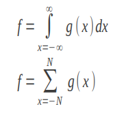

# Representations

We can not only manipulate values in function but also the indices.
- e.g. `f(x) = [1,2,3,4,5,6,7,8,9,10]` -> `f(x+1) = [2,3,4,5,6,7,8,9,10,1]`

- Calculations:

- Integral for getting area from graph g(x) (basically sums all values in g(x))

When we have discrete values, this integral becomes a sum function. The sum function is the same as the integral but
sums all values in natural number range and we don't have to worry about the "dx" (small region) as our image is already
broken up into regions.

- Another example of integral of a product of two functions.

It is a lot simpler than conventional calculus.