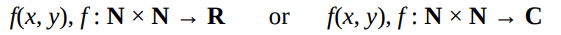
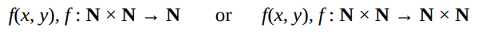
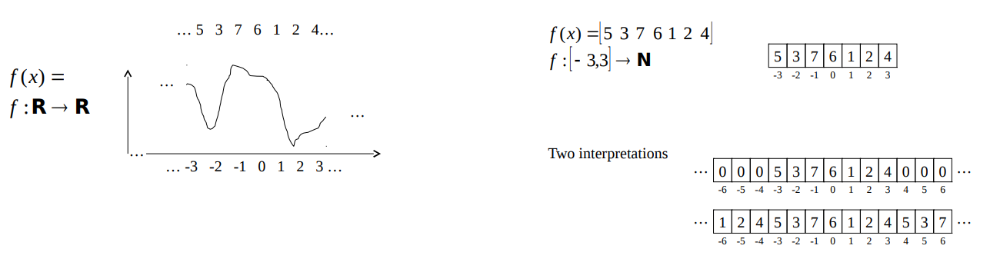

# Transforms

- A transform rearranges a signal for easier processing or to allow processing which would otherwise be impossible.
    - e.g. in data structures we can sort a list to make searching for maximum value easier.

- Simple reversible transformation:
    - `T: R -> R, T(f(x)) = f(-x)`
    - This is a reversible transformation because we can apply the same transformation to the output to get the original input.

A transform is a function that operates on functions e.g. image compression, fourier transform etc.

**Signals and Images**

A signal is one dimensional and can be stored in memory as a single array, an image is two-dimensional.

- 2D Signals:

- Input of a pair of natural nums (2 args) and output real number or complex number

Row and column indices are natural numbers. At a certain point in the image, we have a value. The value can be a real or complex number.

- Digital Equivalent:

- Inputs the same but outputs are natural number or a 2D array of natural numbers.

This is often called an **image** and can be stored as an array of arrays (2D array).

Digital signals are usually processed by software but can also be processed electrically or by analog electronic processing and optical processing.
- Hearing aids are processed electrically. Processing electronically is faster than processing by software as it is direct.

**Analytical vs. Digital Description of Signals**

Analytical -> captures **all** information about a signal e.g. sin(x) will capture all information of a particular sin wave.
- Very few signals that have a nice concise description like this.

Allows for negative indices although programming languages don't allow this.
- Therefore, what we record in memory is a sequence of natural numbers.

We assume functions go to infinity.

- 2 Interpretations of the above:
    - Zeros are filled for all unknown areas of the memory
        - The function is zero everywhere except for the known values
    - Memory repeats infinitely to the left and right of the known values
        - The function is periodic
        - This is the assumption a Fourier transform makes
