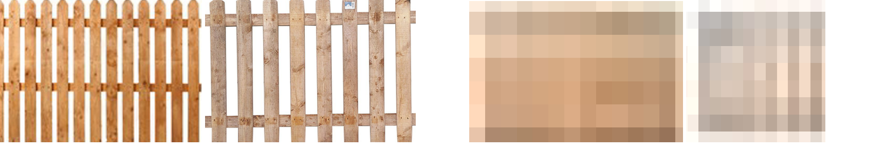
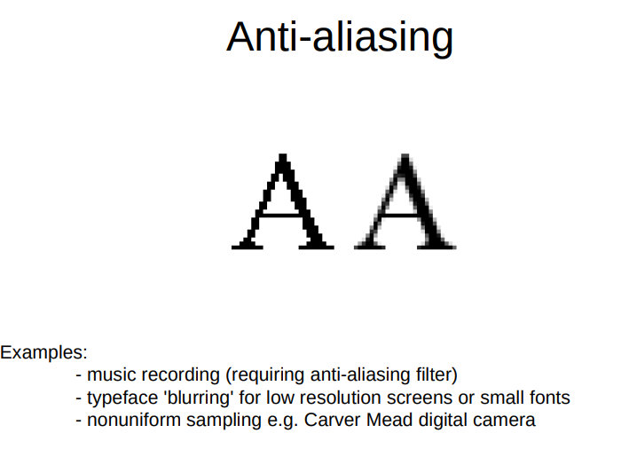
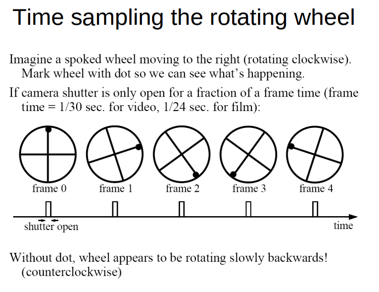

# Aliasing

It is not wanted and can occur during a digital recording of an analogue signal.

- Aliasing occurs when the sampling frequency is less than twice the highest frequency component in the signal.

Once the sampling rate is fixed as some value, we can predict what frequencies will cause aliasing.

If high frequencies are not recorded, it will lead to a loss of information e.g. blurred version.

Aliasing causes signals that are very different from each other to be indistinguishable when sampled – in general,
we will not know whether any part of the signal was actually in the original signal or if it was generated by aliasing.

- Sawtooth waveform example of aliasing on moodle

# Sampling

- Sampling is the process of converting a continuous signal into a discrete signal.
- The sampling rate is the number of samples per second.
- The sampling frequency is the number of samples per second.
- The sampling period is the time between samples.
- The sampling theorem states that a continuous signal can be perfectly reconstructed from its samples if the sampling
  frequency is greater than twice the highest frequency component in the signal.

Aliasing example of divers image

